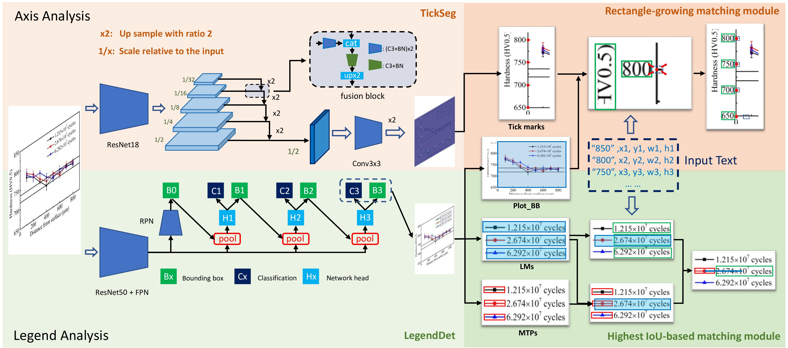

# CHART-DeMatch
CHART-DeMatch is a framework of chart panel analysis(CPA). The CPA task contains two subtasks: axis analysis and legend analysis.

**Axis Analysis:** The axis analysis system is expected to output the location of  tick  mark  and  associated  corresponding  value  text  on  both  the  X-axis  and Y-axis. 

**Legend Analysis:** In a chart, each legend mark is associated with a dataseries name. For the understanding of chart with multiple data series, it is criticalto analyze the legend first. The legend analysis system is responsible for finding all the legend marks area, and link them to the associated label text.

**Please see our paper at [[link]](https://)**. <div align=center></div>


## Train
### 1. Legend Analysis
We use the framework of [mmdetection](https://github.com/open-mmlab/mmdetection) to train the 
detection network. The model config file is legend_match/cascade_mask_rcnn_r50_fpn.py.
Please follow the repository to install mmdetection and train a detection model.

### 2. Axis Analysis
Environment dependencies are shown below 
```
cudatoolkit=10.1
pytorch=1.4.0
torchvision=0.5.0
numpy
yacs
Pillow
```

After downloading data, you should train a main_plot_region detection network and prepare the detection result file (.pth) first. (Deault: 
the .pth file from [detectron2](https://github.com/facebookresearch/detectron2)).

Then modified the path in det/dataset/datasets.py and train.py
```
# dataset.py, take RealDataset as an example
img_dir = "/path/to/data images"
gt_dir = "/path/to/data annotation JSON"
icpr_test_json = "/path/to/test data annotation JSON"
icpr_test_images = "/path/to/test data images"


# train.py
img_dir = "/path/to/data images"
input_dir = "/path/to/data annotation JSON"
bb_dir = "/path/to/main_plot_region detection file (.pth)"
coco_json_path = "/path/to/coco format json" (corresponding to bb_dir)
```
run
```
sh train.sh
```

## Inference
### 1. Legend Analysis
Modified the related path in legend_match/det_demo.py, run
```
python3 det_demo.py
```
to get the detection result. 
Modified the save path in legend_match/find_final_result.py, run
```
python3 find_final_result.py
```


### 2. Axis Analysis
Modified the path in demo.py
```
img_dir = "/path/to/data images"
save_dir = "/path/to/save result"
```
run
```
python3 demo.py
```

# Citation
If you find our method useful for your reserach, please cite
```
@article{zhang2021dematch,
  title={DeMatch: Torwards Understanding the Panel of Chart Documents},
  author={Zhang, Hesuo and Ma, Weihong and Jin, Lianwen and Huang, Yichao and Ding, Kai and Wu, Yaqiang},
  journal={Proceedings of International Conference of Document Analysis and Recognition},
  year={2021}
}
```